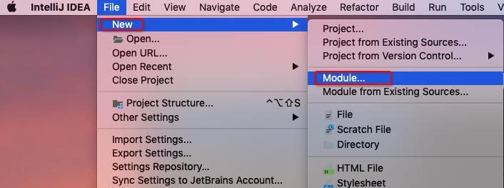
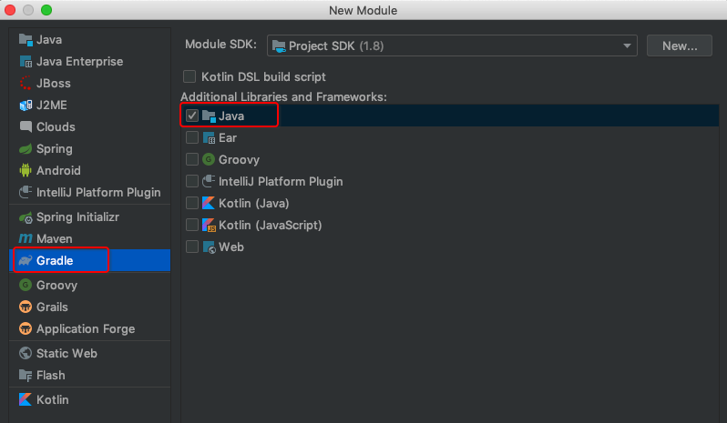
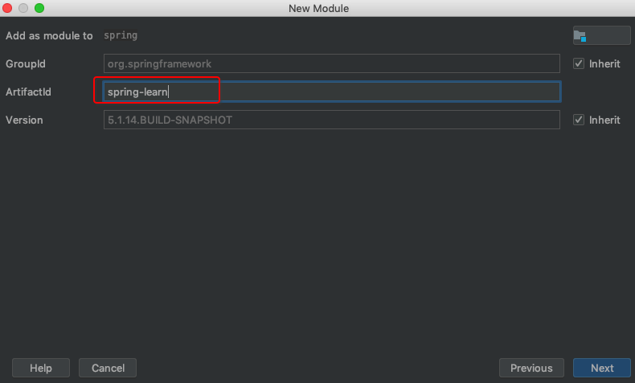

# SpringLearn
> 2020，还不看看Spring源码的话，都老了～～～～

为了验证源码的正确性，我们在项目中新增一个Module来验证一下，具体步骤如下（这里过多描述如何创建一个Module）：

[spring-learn项目](../../spring-learn)创建好后，我们将本地的spring-context添加到gradle依赖中，如下图所示：

编写代码进行验证, 验证一下我们创建的bean是否可以通过getBean获取到, 如下图所示：

