# Spring-Source-Code-Local-Test（本地测试）
> 2020，还不看看Spring源码的话，都老了～～～～

> 在第一篇中，我们已经把Spring源码导入了Idea中并且通过gradle编译，将项目构建好了，本篇我们就要开始验证一下本地环境。

## 一、运行测试类
我们先使用spring-core模块跑一下所有的单元测试，如果测试类都跑通过了，即证明本地环境是好的。下面我们就开始吧！

### 1.1 选择spring-core项目
* 1.操作流程：
    ``spring-core --> test --> java --> org.springframework --> Run "Tests" In springframework``, 如下图所示：
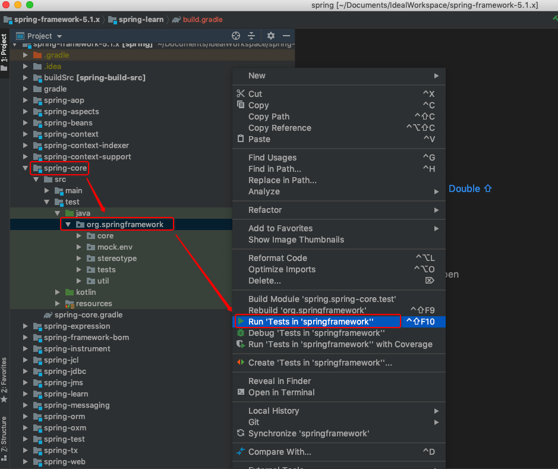

* 2.查看结果
从控制台看，发现我们运行后报错了，根据提示信息可以看到是缺少对应的jar依赖导致的，如下图所示：
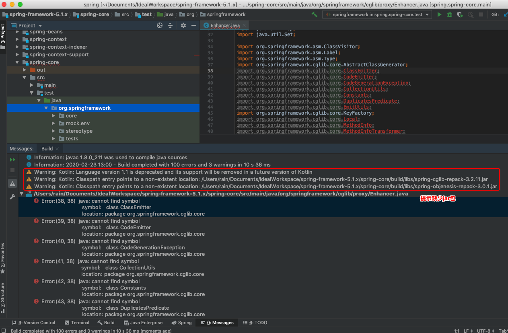

## 二、错误原因排查
首先，我们打开源码对应的包路径：``spring-core\src\main\java\org\springframework\cglib``, 发现下面有一个package-info，打开这个文件，如下图所示：
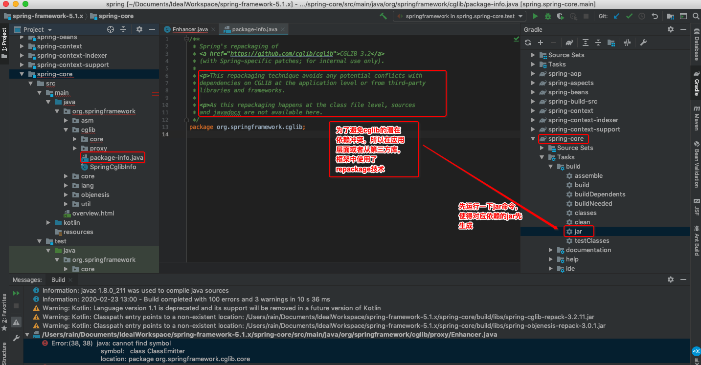

从这个说明文件中，我们可以知道，spring为了避免cglib包依赖可能存在潜在的冲突，所以需要我们使用repackage技术来进行解决（具体啥是repackage技术后续补充），
为了解决这个问题，我们可以先使用Idea工具自带的build jar工具先跑一下，如下图所示：
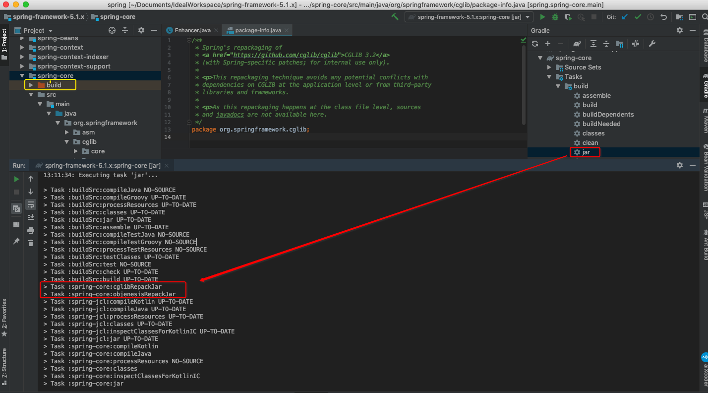

执行完成之后，我们看下控制台的日志，可以发现这两个包的依赖加入进来了，为了进一步找一下原因，我们可以查看一下spring-core项目的gradel配置文件，如下图所示:
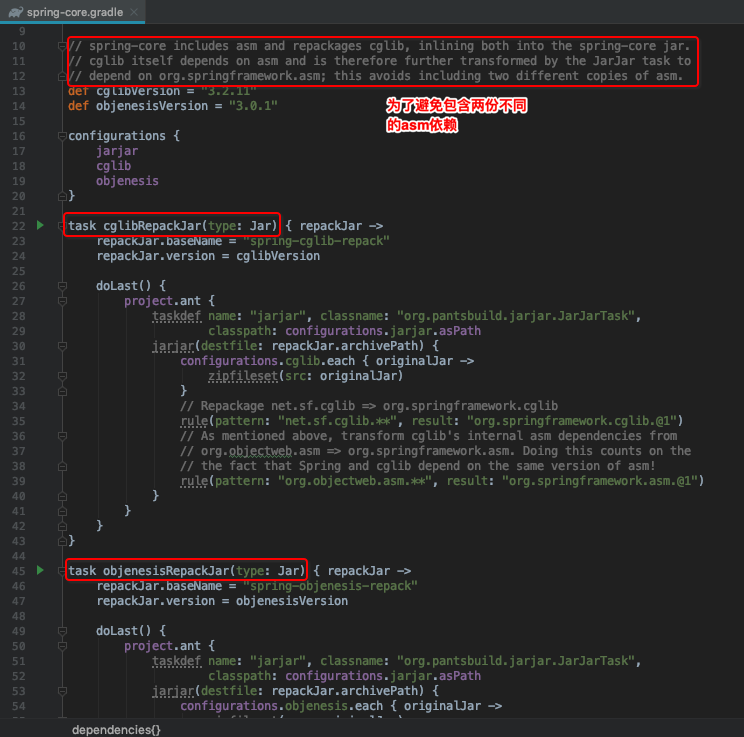

从[配置文件](../../spring-core/spring-core.gradle)中，我们可以看到有如下注释：
```xml
// spring-core includes asm and repackages cglib, inlining both into the spring-core jar.
// cglib itself depends on asm and is therefore further transformed by the JarJar task to
// depend on org.springframework.asm; this avoids including two different copies of asm.
```
大概意思是为了避免重复加载asm依赖，另外配置文件下面还配置两个repackagejar的任务，就是我们刚开始看到的缺少jar.

## 三、重跑测试
* 1.重新执行spring-core测试类
    知道上面的原因后，我们重新按照第一部分的步骤重新来跑一遍，如下图所示：
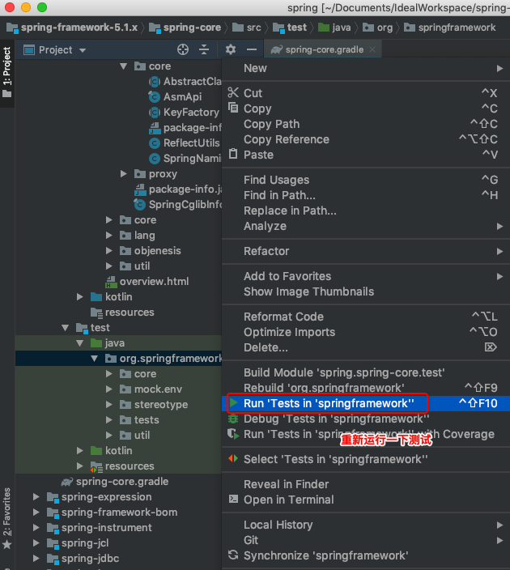

* 2.查看结果，如下图所示：
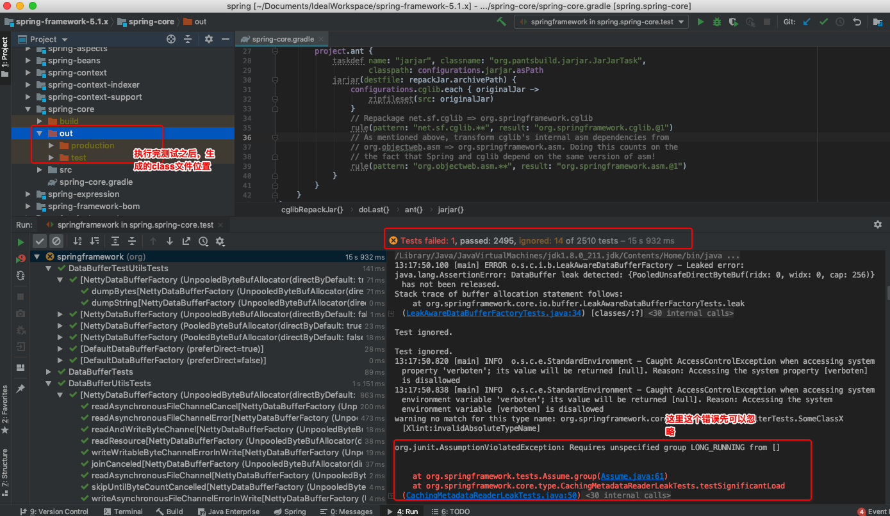

* 3.执行spring-beans，结果如下：
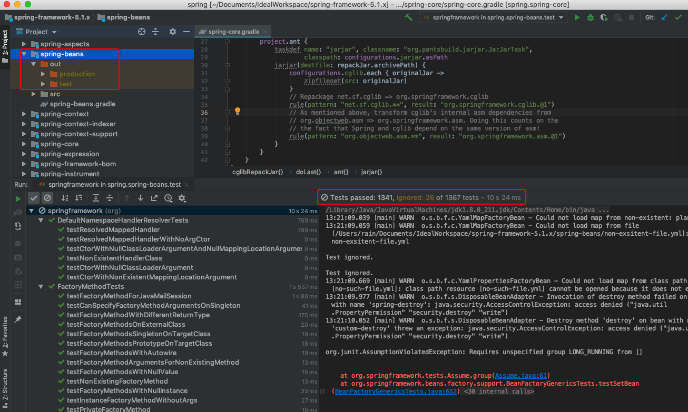

* 4.执行spring-context,结果如下：
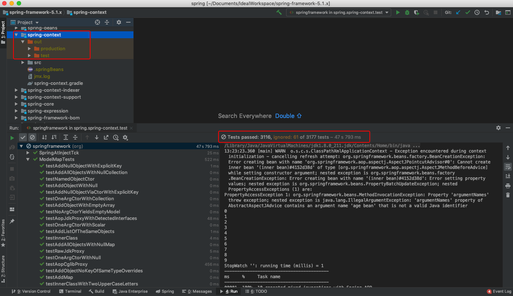

到此，我们把spring-core,spring-beans,spring-context三个模块都跑了一下单元测试，接下来，我们就在这个项目中创建一个新的spring-learn模块来测试一下。

## 四、代码验证
* 1.项目创建
为了验证源码的正确性，我们在项目中新增一个Module来验证一下，具体步骤如下（这里过多描述如何创建一个Module）：
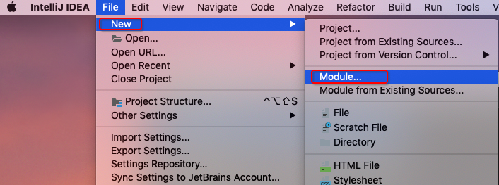
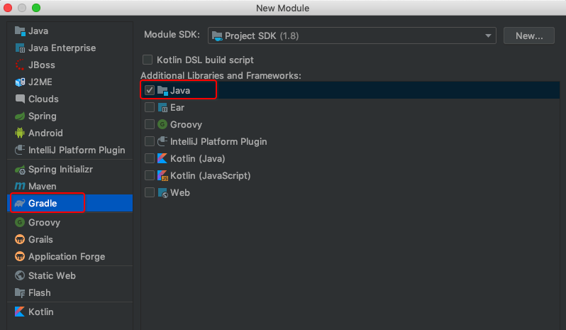
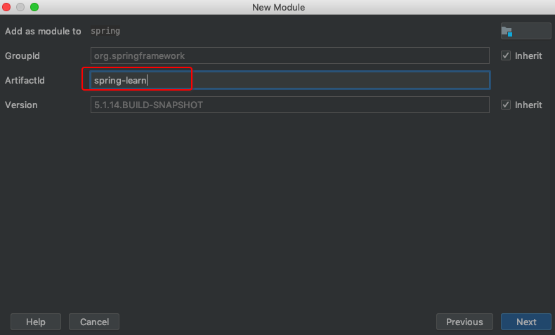
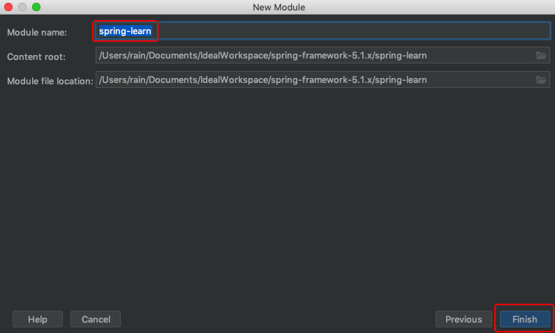

* 2.修改依赖配置
[spring-learn项目](../../spring-learn)创建好后，我们将本地的spring-context添加到gradle依赖中，如下图所示：
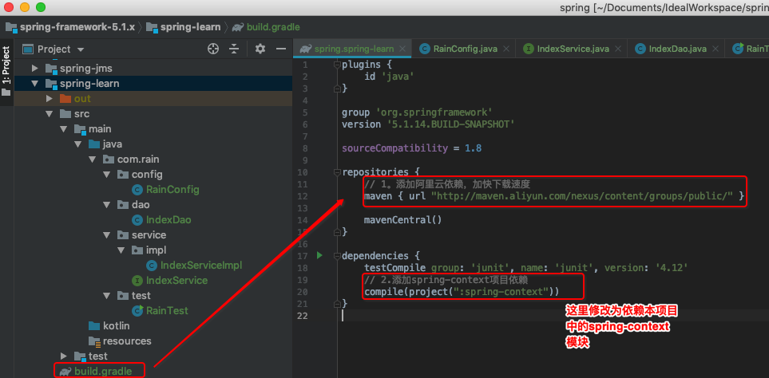

* 3.代码预览
配置类：配置扫包路径
```java
package com.rain.config;

import org.springframework.context.annotation.ComponentScan;
import org.springframework.stereotype.Component;

/**
 * <pre>功能描述：</br>启动扫包配置<pre>
 * @ProjectName spring
 * @Author rain
 * @date 2020-02-23 13:28
 * @version v1.0
 */
@Component
@ComponentScan("com.rain")
public class RainConfig {
}
```
测试类：获取Bean测试
```java
package com.rain.test;

import com.rain.config.RainConfig;
import com.rain.service.IndexService;
import org.springframework.context.annotation.AnnotationConfigApplicationContext;

/**
 * <pre>功能描述：</br>基本测试<pre>
 * @ProjectName spring
 * @Author rain
 * @date 2020-02-23 13:39
 * @version v1.0
 */
public class RainTest {

	public static void main(String[] args) {

		AnnotationConfigApplicationContext ac = new AnnotationConfigApplicationContext(RainConfig.class);

		IndexService indexService = (IndexService) ac.getBean("indexServiceImpl");

		System.out.println(indexService.queryIndex());
	}
}

```

编写代码进行验证, 验证一下我们创建的bean是否可以通过getBean获取到, 如下图所示：
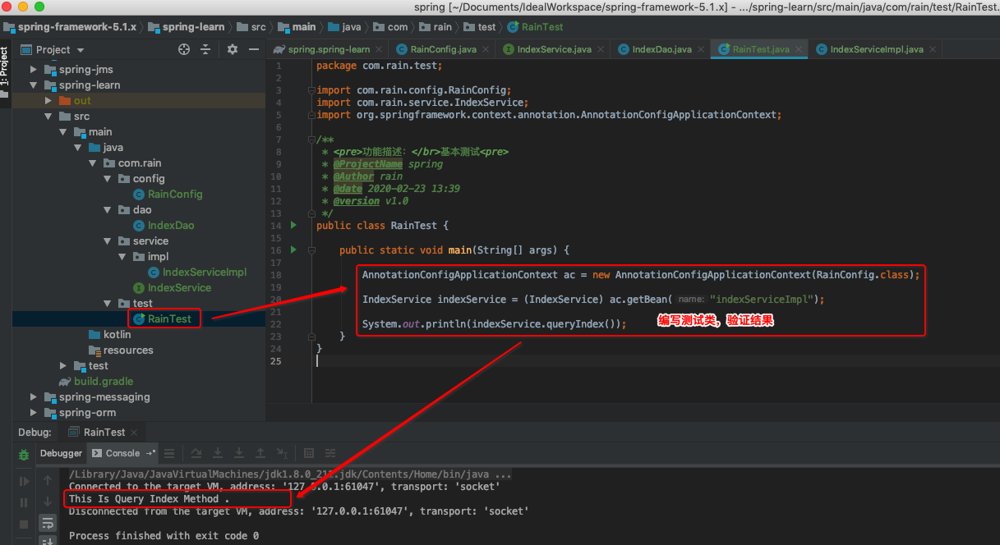

