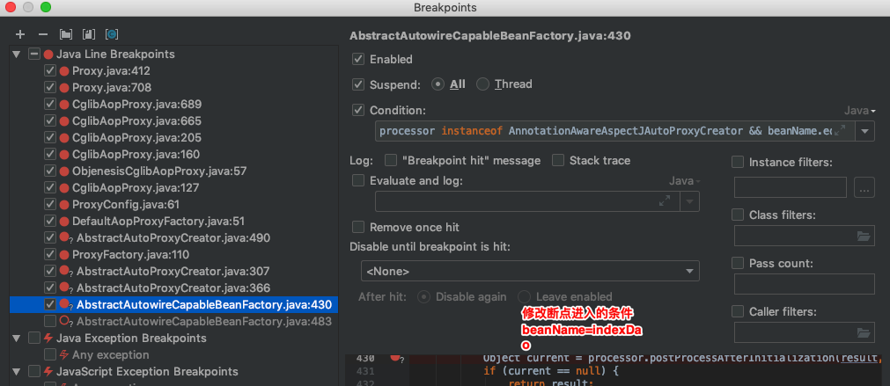
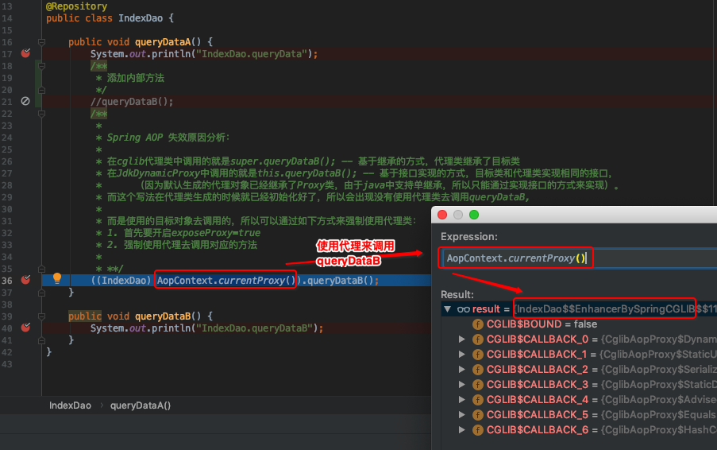

# Spring-Source-Code-AOP分析
> 2020，还不看看Spring源码的话，都老了～～～～

## 一、Spring AOP 基本概念
Supported Pointcut Designators(支持的切点设计)
> Spring AOP supports the following AspectJ pointcut designators (PCD) for use in pointcut expressions:
    * execution: For matching method execution join points. This is the primary pointcut designator to use when working with Spring AOP.
    * within: Limits matching to join points within certain types (the execution of a method declared within a matching type when using Spring AOP).
    * this: Limits matching to join points (the execution of methods when using Spring AOP) where the bean reference (Spring AOP proxy) is an instance of the given type.
    * target: Limits matching to join points (the execution of methods when using Spring AOP) where the target object (application object being proxied) is an instance of the given type.
    * args: Limits matching to join points (the execution of methods when using Spring AOP) where the arguments are instances of the given types.
    * @target: Limits matching to join points (the execution of methods when using Spring AOP) where the class of the executing object has an annotation of the given type.
    * @args: Limits matching to join points (the execution of methods when using Spring AOP) where the runtime type of the actual arguments passed have annotations of the given types.
    * @within: Limits matching to join points within types that have the given annotation (the execution of methods declared in types with the given annotation when using Spring AOP).
    * annotation: Limits matching to join points where the subject of the join point (the method being executed in Spring AOP) has the given annotation.

## 二、TODO

## 三、AOP使用问题场景演示

## 四、Spring AOP 代理类生成两种方式对比

~~ 由于时间仓促，初版编写，后期会更新

